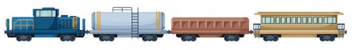

<h1 > Train Composition System </h1>

Discipline: Programação Orientada a Objetos
Class:10
Professor: Bernardo Copstein

### Authors

| [ Giselle Chaves](https://github.com/GiselleChaves) |     | [ Ashiley Bianca](https://github.com/ashileybianca) |
| :--------------------------------------------------------------------------------------------------------------------------------------------------------: | :-: | :--------------------------------------------------------------------------------------------------------------------------------------------------------: |

  

### Introduction

This is the README document, here will be showed some informations about the project.

### Goal

The project aims to present the resolution of the activity proposed as Work 1 of the discipline.

### :hammer: Project features

- `Options Menu`: The menu give for the user options like create, edit, list, dismantle or finish the program, thar will be listeds below:

  - `Create Train`: This feature have the options:

    - Create a train, initializing with the "Traind Id" and the "Locomotive Id";
    - When the train is created, the locomotive is retirated of the Locomotive Garage, and the new train is inserted in the list of trains and in the Train Yard.

  - `Edit Train`: This feature have the options:

    - To add a wagon, and remove it of the wagon garage;
    - To add a locomotive, and remove it of the Locomotive Garage;
    - To remove the last wagon or locomotive, and move it to their respective garage;
    - To list the free wagons and locomotives in the garage;
    - Exit of the feature "Edit Train";
    - In addition an default option, in case the choised option was invalid,

  - `Dismantle Train`: This feature have the options:

    - To remove a wagon of the train and move it for the Wagons Garage;
    - To remove a locootive of the train and move it for the Locomotive Garage;

  - `Train Figure`: The system have too a static method that is called to print an train figure, like extra for the initializing menu.

### 🛠️ Open and Run the project

After to do the download of the project:

- Open the file of the project;
- Open the terminal and use the command "code ." to open the IDE if you are using the VsCode;
- In the Class "TrainCompositionSystem you can follow the steps:

  - In the taskbar click on "run";
  - Click in the option "run withouth debugging";
  - The terminal will open and you can start the use the system, always following the menu options.
  

##### ⚠️Our code is avaliable on the GitHub
